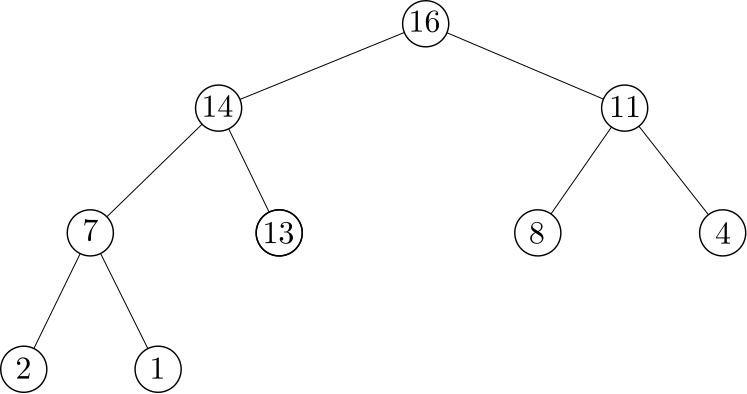
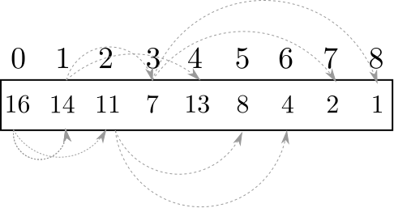
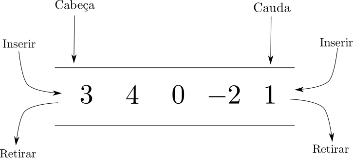
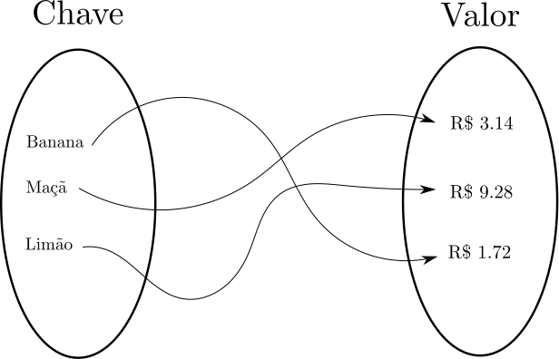
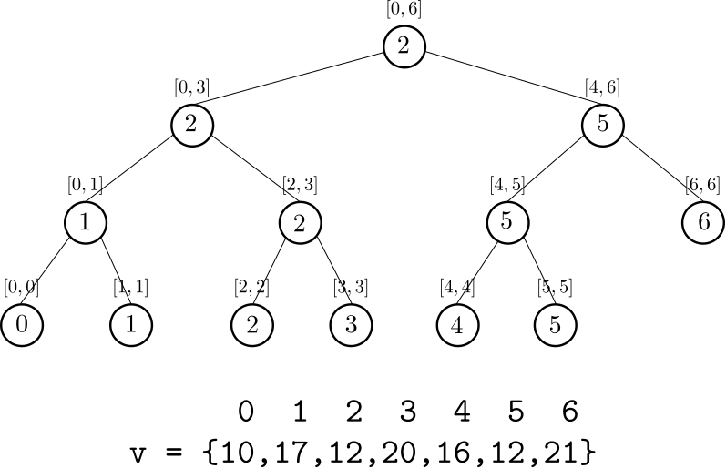
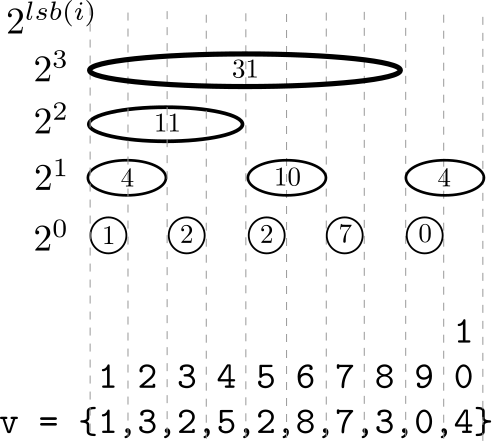

* TOC
{:toc}

Estruturas de dados proveem meios de organizar e manipular informações de maneira eficiente. Para resolver problemas de uma maneira rápida, fazemos o uso de estruturas de dados adequadas. É papel de um bom programados saber selecionar as melhores estruturas que se encaixam nas soluções propostas. A seguir apresentaremos uma visão sucinta de cada uma delas.


## Vetores

### Vetores Estáticos
	
Vetores estáticos correspondem a uma sequência de dados de mesmo tipo. O tamanho deles geralmente é definido na declaração. É possível declarar vetores de uma, duas, três ou até quatro dimensões com facilidade. Quando se sabe de antemão o tamanho máximo de uma entrada, é uma estrutura que pode ser utilizada sem problemas.


### Vetores Dinâmicos 	

É possível projetar vetores que se adequam ao tamanho dos dados. Quando chegam novos dados, o vetor aumenta e quando dados são retirados ele diminui. Felizmente, a maiora das linguagens de alto-nível fornecem estas estruturas em suas bibliotecas padrão. Podemos citar: `vector<>` (C++) e `ArrayList` (Java).

Uma série de operações são normalmente disponibilizadas pela API padrão do  C++ e podem ser visualizadas neste [link]( http://www.cplusplus.com/reference/vector/vector/).

Através do cabeçalho `<vector>` é possível utilizar esta estrutura de dados e seus métodos mais notáveis são:

- `size`: retorna o número de elementos do vetor.
- `front`: retorna o primeiro elemento do vetor.
- `back`: retorna o último elemento do vetor.
- operador `[]`: acessa o elemento indexado através da notação de colchetes.
- `push_back`: insere o elemento `x` no vetor.
- `pop_back`: remove o último elemento do vetor.





Note que é possível utilizar a notação padrão de colchetes nesta estrutura.

### Complexidade 

|:-----------:|:------------:|
|   Operação  | Complexidade |
| `push_back` |     $O(1)$     |
| `pop_back`  |     $O(1)$     |
| `[]`        |     $O(1)$     |

### Ordenação
  A STL conta com método de ordenação para o `vector` chamado de `sort`.

Caso um tipo nativo da linguagem esteja sendo trabalhado, já existe uma forma padrão de comparação, como ilustrado pelo código abaixo, que ordena em ordem crescente um vetor de strings.





Caso uma forma não padrão de comparação de elementos seja desejada para obter uma ordenação correta, é possível fazer isso de três formas:


#### Utilizando o Operador <

Ao implementar o operador `<` em uma classe, é estabelecida uma relação de ordem entre objetos desta classe, o que pode ser utilizado para ordenação.

No exemplo abaixo, O operador `<` é definido para estabelecer uma relação de ordem entre duas pessoas. O critério é, uma pessoa deve preceder a outra caso seja mais nova. Se duas pessoas tem a mesma idade, a pessoa com a maior renda mensal precede a outra.





#### Utilizando Functores

Functores são objetos instanciados que permitem ser invocados com funções. Para usar um functor, é necessário criar um operador de função `()` na classe que descreve o functor. O exemplo da seção anterior adaptado para functores está ilustrado abaixo.






#### Utilizando Funções

Por fim, também é possível indicar qual função de comparação deve ser utilizada no método sort, conforme ilustrado no código abaixo.





#### Complexidade

O método padrão de ordenação da STL leva tempo ótimo $O(n\lg n)$.

### Busca

Em vetores ordenados é possível buscar elementos de maneira eficiente do que em uma busca sequencial. Para isto utilizamos dos métodos `lower_bound` e `upper_bound` do cabeçalho `<algorithm>`. Seja $x$ um valor a ser pesquisado, temos: 

- `lower_bound`: retorna um iterador para o primeiro elemento não menor do que $x$.
- `upper_bound`: retorna um iterador para o primeiro elemento maior do que $x$.

Desta forma, caso $x$ ocorra em um vetor `v`, temos que de `lower_bound` até uma posição antes de `upper_bound`, concentram-se todas as ocorrências de $x$.

O exemplo a seguir de [cplusplus](http://www.cplusplus.com/reference/algorithm/upper_bound/) ilustra os métodos apresentados.






#### Complexidade 

Internamente estes procedimentos realizam uma busca binária. Por esta razão, tanto `lower_bound` quanto `upper_bound` levam tempo $O(\lg n)$.

## Heaps

Uma Heap é uma estrutura de dados em forma de árvore binária completa que possui a seguinte propriedade: 
- A raiz tem precedência sobre os seus dois filhos.
- A árvore com raiz no filho da esquerda é uma heap.
- A árvore com raiz no filho da direita é uma heap.

A figura a seguir ilustra uma Heap.



Como se trata de uma árvore binária completa, é possível representar uma Heap através de um vetor. A navegação desta árvore virtual através de uma aritmética simples. Se um nó ocupa o índice $i$ do vetor, temos:

- O pai ocupa a posição $(i-1)/2$.
- O filho da esquerda ocupa a posição $(i*2) +1$.
- O filho da direita ocupa a posição $(i*2) + 2$.

Usando esta representação, é possível representar a árvore anterior pelo seguinte vetor:



A grande vantagem de uma heap é que o elemento de maior precedência encontra-se na raiz da árvore, ou seja, na posição $0$ do vetor. Assim, dado que um vetor tenha a propiedade de heap, é possível encontrar o elemento de maior precedência em tempo $O(1)$.

Para remover o elemento de maior precedência, trocamos ele com a última folha e, partindo da raiz, trocamos com o maior dos seus filhos até que isto não seja mais possível. Isso é exemplificado pelos seguintes códigos:









Para inserir o processo inverso é feito: o novo elemento é adicionado no final do vetor como uma folha e ele é trocado com o pai até que ele atinja a posição $0$ (raiz) ou até que ele tenha menor precedência que o seu pai, conforme ilustrado pelos códigos a seguir.










Para transformar um vetor em uma heap, para que as operações supracitadas possam ser aplicadas, podemos simplesmente examinar os elementos, em ordem decrescente de altura, aplicando o procedimento de trocá-los com os seus filhos sempre que tiverem menor precedência, como abaixo:






É possível utilizar esta estrutura de dados através do cabeçalho `<algorithm>`.
Os métodos mais notáveis são:

- `make_heap`: transforma um vetor em uma Heap.
- `front`: retorna o elemento de maior precedência de uma Heap.
- `pop_heap`: reestrutura a Heap para remover o elemento de maior precedência. Deve ser acompanhado de um `pop_back`
- `push_heap`: reestrutura a Heap após a inserção de um elemento. Deve ser precedido de um `push_back`.

O seguinte código ilustra a operação de uma Heap.





### Complexidade

Como virtualmente temos uma árvore completa e cheia, as operações de inserção de um elemento e remoção do elemento de maior precedência levam tempo proporcional a altura da árvore, que é no máximo $O(\lg n)$.

O acesso ao elemento de maior precedência leva tempo constante: basta acessar a posição $0$ do vetor.

|:-----------:|:------------:|
|   Operação  | Complexidade |
| `push_heap` |     $O(\lg n)$     |
| `pop_heap`  |     $O(\lg n)$     |
| `front`        |     $O(1)$     |


## Pilhas

Pilhas são estruturas de dados que seguem a ordem LIFO (Last-in-first-out), ou seja, os últimos elementos que entram, são os primeiros a serem retirados.

Esta estrutura está disponível através do cabeçalho `<stack>` e seus métodos mais notáveis são:

- `top`: retorna o elemento que ocupa o topo da pilha.
- `push`: insere um elemento na pilha.
- `pop`: retira um elemento da pilha.
- `empty`: verifica se a pilha está vazia.
- `size`: retorna o tamanho da pilha.
  
O exemplo a seguir utiliza uma pilha para ler uma série de nomes e imprimí-los em sua ordem inversa.





### Complexidade

|:--------:|:------------:|
| Operação | Complexidade |
| `top`    |    $O(1)$    |
| `push`   |    $O(1)$    |
| `pop`    |    $O(1)$    |

## Filas 

Ao contrário das Pilhas, Filas são estruturas de dados que seguem a ordem FIFO (first-in-first-out), ou seja, o primeiro elemento que é inserido, deve ser o primeiro a retirado. 





### Complexidade

|:--------:|:------------:|
| Operação | Complexidade |
| `front`  |    $O(1)$    |
| `push`   |    $O(1)$    |
| `pop`    |    $O(1)$    |

## Filas de Prioridade 

Filas de prioridade não seguem a ordem FIFO. Elas procuram estabelecer uma prioridade entre os elementos de forma que, independentemente de quando foi inserido, o elemento de maior prioridade deve ser retirado.

Internamente, esta estrutura de dados geralmente é implementada através de uma **Heap** e está disponível através do cabeçalho `<queue>`. Podemos citar como exemplos os métodos:

- `empty`: verifica se a fila de prioridade está vazia;
- `size`: retorna o tamanho da fila de prioridade;
- `top`: retorna o elemento de maior prioridade;
- `push`: insere um elemento na fila de prioridade;
- `pop`: remove o elemento de maior prioridade.

O código abaixo mostra uma situação hipotética em que várias pessoas são inseridas em uma fila de prioridade. Neste caso, definimos através do operador `<` uma relação de ordem entre as pessoas para que duas pessoas possam ser comparadas e avaliadas de acordo com a sua prioridade. No caso, pessoas mais velhas tem mais prioridade do que pessoas mais novas e que, quando as pessoas tem a mesma idade, a com menor renda mensal tem prioridade.





Considere a seguinte entrada:

| Nome    | Idade | Renda Mensal |
|---------|-------|--------------|
| Daniel  |   30  |    1000.0    |
| Daniela |   30  |     400.0    |
| José    |   50  |    2000.0    |
| Pablo   |   80  |    6000.0    |
| Carlos  |   30  |     500.0    |

O programa selecionaria as seguintes pessoas de acordo com a prioridade pré-definida:

Pablo
80
6000

Jose
50
2000

Daniela
30
400

Carlos
30
500

Daniel
20
1000




### Complexidade

Como são baseadas em Heaps, as filas de prioridade possuem as seguintes complexidades.

|:--------:|:------------:|
|   `top`  |    $O(1)$    |
| `push`   |  $O(\lg n)$  |
| `pop`    |  $O(\lg n)$  |


## Deques

Deques (Double-ended queues), são estruturas de dados que combinam pilhas e filhas.
É possível inserir e remove elementos das duas extremidades e normalmente utiliza-se uma estrutura híbrida de vetor e listas na implementação.



Os deques podem ser utilizados através do cabeçalho `<queue>` e os principais métodos podem ser elencados como:

- `front`: acessa o elemento que está na cabeça do deque.
- `back`: acessa o elemento que está na cauda do deque.
- `push_back`: inserção na cauda do deque.
- `pop_back`: remoção na cauda do deque.
- `push_front`: inserção na cabeça do deque.
- `pop_front`: remoção na cabeça do deque.
- `empty`: verifica se o deque está vazio.
- `size`: retorna o tamanho do deque.
- Operador `[]`: retorna o elemento do deque na posição indicada na notação de colchetes.


## Vetores de Bits

Vetores de bits são estruturas que representam uma sequência de valores $0$ ou $1$. Em comparação com um vetor, essas estruturas são preferidas neste cenário pois conseguem economizar espaço e tempo, uma vez que menos acessos a memória são feitos para recuperar valores.

### Bitset

O C++ oferece através da STL a classe `bitset`, que permite a criação de vetores de bits estáticos. Ou seja, o tamanho da estrutura deve ser definida em tempo de compilação e não pode ser redimensionada.

Esta classe possibilita:

- `set`: atribui ao bit indicado o valor $1$.
- `reset`: atribui ao bit indicado o valor $0$
- `flip`: inverte o bit de uma determinada posição.
- `count`: conta o números de bits com valor $1$.
- operador `[]`: acessa o bit indexado pela notação de colchetes.

O código a seguir exemplifica o uso dessa estrutura.





### Representação através de Vetores Dinâmicos

#### Operações bit-a-bit e máscaras

Podemos representar os vetores de bits através de um vetor de inteiros, basta lembrar que qualquer inteiro é representado por uma sequência de bits.

Por exemplo, o inteiro

```
42 (decimal) = 101010 (binário)
```

Para acessar o valor de um bit em específico, usamos os operadores bit-a-bit em conjunção com as **máscaras de bit**.

Estes operadores aplicam uma operação lógica em um inteiro, no caso de um operador unário, ou entre dois inteiros, no caso de um operador binário.

- Operador unário: `~` (NOT).
- Operadores binários: `&` (AND), `|` (OR), `^` (XOR), `<<` (Shift-left) e `>>` (Shift-right).  


Os operadores de `>>` e `<<` servem para deslocar os bits posições à esquerda ou a direita.

Por exemplo: `00101010 >> 1 = 00010101 (binário) = 21 (decimal)` e  ` 00101010 << 2 = 10101000 (binário) = 168 (decimal)`.

Efetivamente, deslocar $i$ posições à esquerda significa realizar a uma multiplicação por $2^i$. Ao deslocar $i$ posições à direita, o resultado equivale a uma divisão inteira por $2^i$.

Considerando o inteiro de 8 bits `x = 42 (decimal) = 00101010 (binário)`, ao aplicar o operador `~` sobre ele, teríamos:

```
~x = 11010101 = 213 (decimal sem sinal) = -43 (decimal com sinal)
```

Ou seja, este operador _flipa_ todos os bits de um inteiro.

Tomando agora como exemplo os inteiros de 8 bits `x = 42 (decimal) = 00101010 (binário)` e `y = 195 (decimal) = 11000011` obteríamos o seguinte ao aplicar os operadores `&`, `|` e `^` entre eles:

```plain
  00101010       00101010       00101010
  11000011       11000011       11000011
& --------     | --------     ^ --------
  00000010       11101011       11101001
```

Ou seja, respectivamente as operações de AND, OR e XOR bit-a-bit.

Através desses operadores, podemos ligar, desligar, inverter  e checar o valor de um bit em específico utilizando as máscaras de bit.

Para ligar o i-ésimo bit (base $0$) de um inteiro `x`, usamos o operador `|` aplicado com a máscara `1 << i`. Por exemplo, se `x=42 (decimal) = 00101010` e desejamos ligar o bit `7`, basta operar `00101010` com `1 << 7 = 10000000`. 

```plain
  00101010
  10000000
| --------
  10101010
```

Para resetar o i-ésimo bit, fazemos uma operação análoga, mas dessa vez utilizando a máscara `~(1<<i)`, que deixa todos os bits ligados, com exceção do i-ésimo, em conjunção com o operador `&`.

Caso quiséssemos desligar o bit $1$ do número `x=00101010`, teríamos:

```plain
  00101010
  11111101
& --------
  00101000 
```

Para alternar o valor do i-ésimo bit, utilizamos a máscara `(1<<i)` aplicada com o operador `^`. Considerando o inteiro `x = 00101010 (binário)` e o bit $2$, teríamos:

``` plain
  00101010
  00000100
^ --------
  00101110 
```

Para checar o valor do i-ésimo bit, basta utilizar a máscara ``(1<<i)`` em conjunção com o operador `&`. Se o resultado for diferente de $0$, então o i-ésimo bit está ligado, caso contrário, desligado. Considerando o inteiro `x = 00101010 (binário)` e o bit $3$, temos:

``` plain
  00101010
  00001000
& --------
  00001000 
```

Como `00001000 = 8 (decimal)` é diferente de zero, sabemos que o bit $3$ está ligado.

Repetindo a mesma consulta para o bit $4$, teríamos: 

``` plain
  00101010
  00010000
& --------
  00000000 
```

Portanto, conseguimos concluir que o bit $4$ está desligado.


#### Utilizando Vetores Dinâmicos

 Vimos como manipular bits utilizando inteiros, no entanto, utilizando apenas um inteiro, só conseguimos manipular uma quantidade de bits comportada por este inteiro. Para representar uma sequência maior de bits, podemos utilizar um vetor de inteiros.

 Considerando um vetor de inteiros de $64$-bits `v`, temos que `v[0]` armazena os bits $0$ a $63$, `v[1]`  os bits $64$
a $127$ e `v[i]` os bits `i*64` a `(i+1)*64 - 1`.

Assim, caso seja desejado manipular o $k$-ésimo bit desta sequência precisamos responder duas questões:
- Em que inteiro esse bit se encontra?
- Dentro deste inteiro, qual o índice deste bit?

Como se trata de um vetor de inteiros de $64$-bits, a primeira questão pode ser respondida através da divisão inteira por $64$. Assim, sabemos que o bit que desejamos manipular está na posição `v[k/64]` ou equivalentemente `v[k>>6]`, se desejamos evitar uma divisão.

Agora que sabemos que o bit desejado se encontra no inteiro `v[k>>6]`, como localizar o índice deste bit neste inteiro? Simples, pegando o resto da divisão de $k$ por $64$. Logo o índice do bit desejado no inteiro é `k % 64` ou `k & (63)`.

Conhecendo o inteiro que contém o bit e o índice deste bit no inteiro, podemos manipular o bit conforme apresentado anteriormente.

Sumarizando o discutido, o código a seguir exemplifica como manipular os bits dentro de um vetor de inteiros.






#### Complexidade

Todas as operações em vetores de bits levam tempo $O(1)$, uma vez que qualquer operação exige um número fixo de expressões aritméticas e atribuições.


## Conjuntos

O tipo de dados abstrato **conjunto** estabelece uma coleção de elementos distintos. Nele é possível através de uma chave: inserir elementos; remover elementos; buscar elementos.

A STL do C++ disponibiliza a classe `set` que implementa este tipo abstrato de dados cujos métodos mais relevantes são:

- `insert`: insere um dado elemento no conjunto.
- `erase`: remove um dado elemento do conjunto.
- `find`: busca um dado elemento no conjunto.

A implementação de um conjunto normalmente é feito através de **árvores binárias balanceadas**, normalmente **Red-Black Trees** no caso da STL, isso configura tempos de inserção, remoção e busca competitivos na prática.
Por conta desta representação, é possível recuperar todos os elementos do conjunto de forma ordenada usando os iteradores.

O código a seguir ilustra a utilização de um conjunto para inserção/remoção/busca de nomes lidos pelo o usuário. Assim que um nome já inserido consta no conjunto, uma mensagem é apresentada. Se o usuário tenta apagar um nome não existente, também recebe um alerta. No final da execução de tal código, todos os nomes são impressos de acordo com a ordem lexicográfica.





### Complexidade

Por serem implementados através de árvores balanceadas, os conjuntos possuem tempo $O(\lg n)$ para as suas operações mais notáveis, uma vez que é este o tempo envolvido de pior caso em um percurso que vai da raiz até uma folha.

|---------|-------|
| `insert`|  $O(\lg n)$ |
| `erase` |  $O(\lg n)$ |
| `find`  |  $O(\lg n)$ |    

## Mapeamentos

O mapeamento é um TAD que associa uma chave a um valor, assim como em uma função matemática, em que um conjunto é associado a outro.



Uma implementação desta abstração é fornecida pelo cabeçalho `<map>` da STL. Um mapeamento que mapeia uma chave do tipo `A` em um valor do tipo `B`, pode ser declarado como `map<A,B> nome_variavel`. Assim como os conjuntos, o mapeamento é implementado através de **Red-Black Trees**.

Os métodos mais notáveis de um `map` podem ser elencados como:

- `insert`: insere um par chave-valor em um mapeamento.
- `erase`: apaga um par chave-valor de acordo com a chave.
- `find`: consulta um determinado par chave-valor a partir de uma chave.
- operador `[]`: permite inserir e recuperar um par chave-valor do mapeamento.

O exemplo abaixo ilustra como realizar a inserção e consulta em um mapeamento através do operador `[]`. O `map` em questão trata-se de um mapeamento do tipo `string` para o tipo `double`. No caso do programa, a cada nome de fruta é associado o preço por Kg daquela fruta.






O `map` também armazena os valores em ordem crescente pela **chave**, então é possível recuperar os valores de acordo com essa ordem como feito no `set`.

Existem algumas nuances em relação à inserção e ao operador `[]` que podem ser conferidas com mais detalhe [aqui](https://www.studytonight.com/cpp/stl/stl-container-map)

### Complexidade

Por serem implementados através de árvores balanceadas, os conjuntos possuem tempo $O(\lg n)$ para as suas operações mais notáveis, uma vez que é este o tempo envolvido de pior caso em um percurso que vai da raiz até uma folha.

|---------|-------|
| `insert`|  $O(\lg n)$ |
| `erase` |  $O(\lg n)$ |
| `find`  |  $O(\lg n)$ |    
| `[]` | $O(\lg n)$ |

## Árvores de Segmentos

Árvores de Segmentos são extremamente úteis para realizar consultas sobre intervalos de um vetor.
Por exemplo, tome o problema do Range Minimum Query (RMQ), que dado um intervalo `[i,j]` de um vetor `v`, consiste em achar o índice $i \leq k \leq j$ de `v` tal que `v[k]` seja o menor possível considerando este intervalo. Para um vetor `v` com os valores `19 17 12 20 16 12 21`, $RMQ(1,3)$, retornaria o índice $2$, uma vez que dentre `v[1]`, `v[2]` e `v[3]`, `v[2] = 12` é aquele que possui o menor valor no intervalo considerado.

Claramente o problema do RMQ pode ser resolvido com uma busca simples em tempo $O(m)$, onde $m$ é o tamanho do intervalo considerado. No entanto, é possível fazer melhor com as árvores de segmentos e reduzir essa complexidade para $O(\lg n)$, em que $n$ é o tamanho do vetor.

Uma árvore de segmentos para o problema do RMQ é uma árvore binária balanceada e completa em que cada nó representa um intervalo que armazena a resposta da consulta. As propriedades desta árvore de segmentos podem ser detalhadas como:

- A raiz representa o intervalo $[0,n-1]$ e armazena a resposta de $RMQ(0,n-1)$.
- Cada folha representa um intervalo unitário $[k,k]$ e armazena a resposta de $RMQ(k,k) = k$.
- Cada nó interno representa um intervalo $[i,j]$ e armazena a resposta de $RMQ(i,j)$. Este segmento do nó interno pode ser dividido em dois sub-segmentos: $[i,(i+j)/2]$ e $[(i+j)/2 + 1,j]$ que dão origem respectivamente aos filhos da esquerda e direita do nó interno original.

A figura a seguir sumariza o descrito até o momento para o vetor com os valores `19 17 12 20 16 12 21`.



Para responder uma consulta $RMQ(i,j)$ utilizamos o seguinte raciocínio recursivo:
- Se o nó representa um intervalo fora da faixa $[i,j]$, retorne $\bot$ (indefinição).
- Se o intervalo do nó está contido em $[i,j]$, retorne o índice armazenado pelo nó.
- Caso contrário, o intervalo representado pelo nó não está contido no intervalo da consulta. Assim, tomamos recursivamente $a = RMQ(i,(i+j)/2)$, o que pode ser obtido pelo filho da esquerda e $b = RMQ((i+j)/2 +1,j)$, o que pode ser obtido pelo filho da direita. Se $a$ e $b$ estão indefinidos, retorne $\bot$. Se $a$ e $b$ não estão indefinidos, retorne $v[a]\leq v[b]$ e $b$ caso contrário. Senão, retorne o valor que não está indefinido.

Por exemplo, tomando a consulta $RMQ(1,4)$ em questão, a busca inciaria da raiz da árvore que representa o intervalo $[0,6]$, como o intervalo do nó não está contido no intervalo da consulta, procedemos recursivamente para o filho da esquerda e o filho da direita.
- O filho da esquerda, que representa o intervalo $[0,3]$, ainda não está contido em $[1,4]$, procedemos para os nós com intervalos  $[0,1]$ e $[2,3]$. A consulta sobre o nó $[0,1]$ é dividida em duas, que retornam $\bot$ e  $1$. Já o nó $[2,3]$ está contido em $[1,4]$, assim a consulta deste filho retorna $2$. Por fim, dentre os resultados da consulta sobre $a = RMQ(1,1)$ e $b =RMQ(2,3)$, selecionamos $b$, pois $v[a] \leq v[b]$.
- O filho da direita representa o intervalo $[4,6]$, que não está contido em $[1,4]$. Dividimos a consulta em duas sobre os filhos da esquerda ($[4,5]$) e o filho da direita ($[6,6]$). O intervalo $[4,5]$ ainda não está contido em $[4,4]$, assim, a consulta é dividida entre $[4,4]$ e $[5,5]$, que retornam $4$ e $\bot$ respectivamente. A consulta sobre o intervalo $[6,6]$ retornará $\bot$. Por fim, dentre os resultados das consultas sobre $[4,4]$ e $[6,6]$, escolhemos a primeira, pois está definida.


<!-- TODO: Inserir GIF  -->

Com tudo o que foi discutido, podemos implementar a árvore de segmentos da seguinte maneira (Halim & Halim).






Pode ser observado que a função `build` computa, de baixo para cima, os valores de cada nó da árvore de segmentos, enquanto a função `rmq` faz exatamente o descrito anteriormente no procedimento de consulta de $RMQ(i,j)$.

### Atualizando Árvores de Segmentos

As árvores de segmentos permitem a utilização de consultas de RMQ em um cenário dinâmico, isto é, em que os valores mudam.
Por exemplo, se o valor de `v[i]` é modificado, apenas é necessário recomputar as respostas do caminho da raiz até a folha com intervalo $[5,5]$ em tempo proporcional a altura da árvore $O(\lg n)$.

### Complexidade

Por se tratar de uma árvore balanceada, todas as operações que envolvem uma árvore de segmentos e percorrem de uma raiz até a folha, levam tempo $O(\lg n)$, o que é muito melhor do que uma busca linear, que leva tempo $O(n)$.

## Árvores de Fenwick

As árvores de Fenwick foram propostas por Peter Fenwick na década de 90 e são muito utilizadas no problema de cálculo de frequências cumulativas em um cenário dinâmico, que dado um vetor `v` (com base em $1$) e um intervalo `[1,i]`, consiste em determinar a soma dos valores `v[k]` $1 \leq k \leq i$, também denotado por $sum(i)$. Uma variação deste problema, consiste em determinar a soma de um intervalo $[i,j]$, denotada por $sum(i,j)$. Cabe ressaltar que os valores de `v` podem ser alterados no decorrer do tempo, alterando o resultado da soma cumulativa.


Claramente, consultas de $sum$ podem ser resolvidas com uma inspeção linear no intervalo, contudo, ela teria complexidade linear no tamanho do intervalo e, dependendo do número de consultas, isso seria inviável.

Uma possível solução para resolver este problema é adaptar as Árvores de Segmentos vistas anteriormente, contudo, as Árvores de Fenwick são consideradas estruturas mais simples e fáceis de implementar. 


Tomando a abordagem presente em ([Topcoder](https://www.topcoder.com/community/competitive-programming/tutorials/binary-indexed-trees/)), considere um vetor `v` indexado em $1$. A ideia por trás de uma Fenwick Tree é representá-la através de um vetor `ft` de tal forma que `ft[i]` armazena a soma acumulada de `v` no intervalo $[i-2^{lsb(i)}+1,i]$ em que $lsb(i)$ corresponde ao índice do bit $1$ menos significativo de $v[i]$. A Tabela a seguir ilustra isso, em que `v` é o vetor original, `c` é a frequência cumulativa e `ft` é a árvore de fenwick. 

| Índice | 0 | 1 | 2 | 3 | 4  | 5  | 6  | 7  | 8  | 9  | 10 |
|--------|---|---|---|----|----|----|----|----|----|----|
| `v`    | 0 | 1 | 3 | 2 | 5  | 2  | 8  | 7  | 3  | 0  | 4  |
| `c`    | 0 | 1 | 4 | 6 | 11 | 13 | 21 | 28 | 31 | 31 | 35 |
| `ft`   | 0 | 1 | 4 | 2 | 11 | 2  | 10 | 7  | 31 | 0  | 4  |

Já a Tabela seguinte ilustra o intervalo considerado por cada nó da `ft`.

| Índice                | 1     | 2     | 3     | 4     | 5     | 6     | 7     | 8     | 9     | 10     |
|-----------------------|-------|-------|-------|-------|-------|-------|-------|-------|-------|--------|
| Intervalo considerado | [1,1] | [1,2] | [3,3] | [1,4] | [5,5] | [5,6] | [7,7] | [1,8] | [9,9] | [9,10] |

A árvore `ft` pode ser ilustrada da seguinte forma:



### Construção da Árvore de Fenwick

Para construir o vetor `ft` em tempo $O(n)$, primeiramente transformamos o vetor
`v` no vetor de soma cumulativa `c`.






Com posse disso, basta notar que qualquer soma sobre um intervalo $[i,j]$ pode
ser decomposta em uma subtração a partir de $c$. Como $c[j]$ contém a soma de $[1,j]$ e $c[i-1]$ contém a soma de $[1,i-1$], concluímos que a soma do intervalo $[i,j]$ é obtida por $c[j]-c[i-1]$.

Logo, qualquer árvore de Fenwick pode ser construída em tempo $O(n)$.
 
### Realizando Consultas

Para realizar uma consulta de $sum(i)$, precisamos abranger todos os nós que cobrem inteiramente o intervalo $[1,i]$. Tomando $i=7$ e o nosso exemlo anterior, temos que a $sum(7)$  = $sum(111b)$ = `ft[111b]` + `ft[110b]` + `ft[100b]` = $18$. Ou seja, o índice do próximo nó a ser somado consiste do índice anterior com o bit $1$ menos significativo desligado. Este procedimento equivale a fazer um percurso do índice desejado até os nós acima que continuam a cobrir o intervalo.

Felizmente, dado um índice, isolar o bit $1$ menos significativo é uma tarefa fácil. Denote um número qualquer $x$ por $x=a1b$ em que $a$ é a porção dos bits que ocorrem antes do bit $1$ menos significativo de $x$ e $b$ são os bits que ocorrem depois, os quais possuem valor $0$.

De acordo com a aritmética de complemento de $2$, sabemos que $-x =  \sim x +1$, e portanto que $-x = \sim (a\mathbf{1}b) +1$. Mas $\sim(a\mathbf{1}b) = (\sim a)\mathbf{0}11\ldots 1$ e portanto, $\sim (a\mathbf{1}b)+1 = (\sim a)\mathbf{1}0\ldots 0$.

Logo, para isolar o bit mais significativo de $x$ , basta fazer `x & -x` uma vez que:

```
       a  1 b
     (~a) 1 b 
  & -----------
    0...010...0
```

Com o disposto acima, para calcular $sum(1,i)$ basta realizar o seguinte procedimento sobre `ft`:





Para calcular $sum(i,j)$, basta aplicar o procedimento anterior com parâmetros $j$ e $i-1$ e subtrair um do outro, conforme o código abaixo: 





### Atualizando Valores

Para que uma atualização de `v[i]` seja refletida em `ft`, é preciso atualizar
os nós que compõem o intervalo $[1,i]$. Note que os valores $sum(1,k)$ com $1\leq < i$ continuarão intactos.
Assim só é necessário atualizar os nós que envolvem o índice $i$, o que pode ser feito de uma forma análoga à consulta, mas considerando os índices à direita de $i$.





Tomando o índice $i=5$ como exemplo, teríamos que atualizar os seguintes índices de `ft`: `101` (3), `110` (6) e `1000` (8).

### Implementação

Consolidando todos os conceitos, temos o seguinte resultado.
Podemos ver que a implementação é bem compacta e mais simples do que a de uma árvore de segmentos.





### Complexidade

Como as árvores de Fenwick possuem altura no máximo $O(\lg n)$ as operações de $sum$ e $update$ são executadas neste tempo.

<!-- ## Hashing  -->
 
<!-- TODO:  -->

## Leituras Recomendadas

- [Referência C++](http://www.cplusplus.com/reference/)
- [Implementação de um Deque](https://stackoverflow.com/questions/6292332/what-really-is-a-deque-in-stl) 
- [Guia para utilização de um map](https://www.studytonight.com/cpp/stl/stl-container-map)
- [Tutorial Topcoder de Fenwick Trees ](https://www.topcoder.com/community/competitive-programming/tutorials/binary-indexed-trees/)