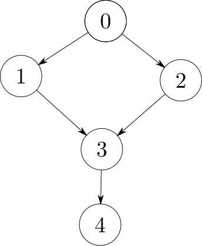
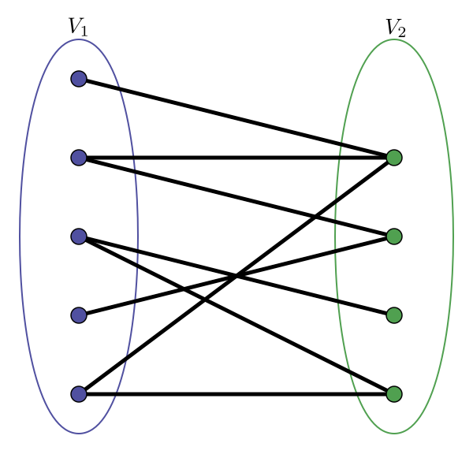

* TOC
{:toc}

A Teoria dos Grafos possui enorme importância, servindo como modelo de diversos problemas. Alguns desses problemas possuem soluções eficientes, enquanto outros não. 

Esta teoria tem uma terminologia específica, que por si só, merece ser estudada a parte.

O material complementar, disposto [aqui](assets/Grafos.pdf) pode ajudar com isso.

A seguir, será assumido que o leitor tem familiaridade com os conceitos básicos de grafos.

## Percurso em Grafos

Uma série de problemas podem ser resolvidos apenas sabendo como caminhar em grafos. Exploraremos algumas aplicações dos diferentes tipos de travessia em grafos nesta seção.

### Busca em Profundidade

A busca em profundidade (*DFS - Depth First Search*) inicia de um nó $u$ e procede recursivamente a um dos seus vizinhos não visitados. Quando a DFS chega a um nó em que não pode prosseguir recursivamente, ela retrocede (realiza o *backtrack*) ao nó pai, presente na chamada da função anterior.

Em uma implementação baseada em listas de adjacências, a busca em profundidade poderia ser implementada da seguinte maneira.






Como a busca em profundidade olha para cada vértice e cada extremidade de cada aresta uma única vez, sua complexidade é $\Theta(\lvert V\lvert +\lvert E\lvert)$ quando implementada em listas de adjacências e $\Theta(\lvert V\lvert ^2)$ sobre matrizes de adjacências.

#### Analogia com Backtracking

De fato, um *backtracking* pode ser visto como uma busca em profundidade, no entanto,  tipicamente em um *backtracking* os nós, ou estados,  são marcados como não visitados quando há o retrocesso, possibilitando uma visita em uma chamada recursiva futura.
Por conta disso, enquanto a complexidade da busca em profundidade é linear no número de vértices e arestas, quando usando listas de adjacências, a complexidade do *backtracking* é exponencial.

O pseudocódigo abaixo deixa claro as similaridades entre uma DFS e um código baseado em *backtracking* partindo de um estado $s$.

1. Se $s$ é um estado final ou um estado inválido, retorne adequadamente.
2. Para cada configuração vizinha derivada do estado $s$
   1. Chame recursivamente a função para a configuração vizinha.

#### Exemplo: UVa 11902

No problema **Dominator** ([UVa 11902](https://uva.onlinejudge.org/index.php?option=com_onlinejudge&Itemid=8&page=show_problem&problem=3053)), recebe-se como entrada uma matriz de adjacências e deseja-se saber, dado um vértice $u$ quais são os vértices que são *dominados* por ele. Um vértice $a$ domina um vértice $b$, quando não existem caminhos do vértice origem $0$ que cheguem em $b$ e não passem por $a$. Por definição, todo nó alcançável da origem domina ele mesmo.


Na figura abaixo, temos que o nó $3$ domina o nó $4$, mas que o nó $1$ não domina o nó $3$, uma vez que existe um caminho alternativo a partir do nó $0$, que passa pelo nó $2$  e chega ao nó $3$.




Como neste problema $\lvert V\lvert \leq 100$, um algoritmo cúbico é o suficiente para construção de uma solução. A ideia é, partir da origem, marque, através de uma DFS, todos os nós alcançáveis da origem como visitados. Para cada nó $x$ visitado a partir da origem, excluímos $x$ do grafo e repetimos a consulta a partir da origem. Um vérticed $y$ não é dominado por um vértice $x$ se:

1. Não é alcançável a partir da origem, ou
2. Após a exclusão de $x$, $y$ é alcançável a partir da origem.

Se nenhuma das condições acima se aplica, $y$ é dominado por $x$. Para resolver o problema, basta aplicar este procedimento para cada nó $x$ do grafo. Ao todo, tem-se tempo $\Theta(\lvert V \lvert \cdot \lvert V \lvert^2) = \Theta(\lvert V \lvert ^ 3)$. 

**Observação**: não é necessário efetivamente modificar a estrutura do grafo e deletar vértices. Basta marcar $x$ como já visitado antes de aplicar a DFS.

### Busca em Largura

A partir de um nó de origem $u$, a busca em largura (*BFS - Breath First Search*) primeiramente visita todos os vizinhos imediatos de $u$ (primeiro nível). Após visitar todos o nós do primeiro nível ela procede para todos os vizinhos dos nós que se encontram no primeiro nível (segundo nível), isto é, os vizinhos dos vizinhos de $u$, e assim por diante.

Essa busca pode ser implementada com o auxílio de uma fila. Inicialmente, para coloca-se o nó de origem na fila $Q$ e:

1. Enquanto $Q$ não está vazia.
2. Retire o nó $x$ da frente da fila.
3. Para cada vizinho $y$ de $x$, se $y$ não está visitado, coloque-o na fila.
4. Marque $x$ como visitado.

Esta estratégia pode ser exemplificada com o código abaixo.






Nesta busca, utiliza-se um vetor de distância a partir da origem para determinar se um nó foi visitado ou não. Caso a distância da origem para o nó esteja como infinito, significa que ele ainda não foi visitado. De brinde, esta busca em largura resolve o problema do menor caminho partindo de uma origem em um grafo sem pesos nas arestas, uma vez que, quando um nó é inserido na fila, a distância da origem para ele é atualizada como sendo a distância da origem ao nó pai mais um.


### Componentes Conexas

Dado um grafo não-direcionado, um problema recorrente é segmentar este grafo em suas componentes conexas. Uma componente conexa de um grafo não-direcionado é simplesmente um conjunto de vértices que se alcançam.

Para achar as componentes conexas, basta aplicar uma busca em profundidade, ou em largura, a cada nó não visitado, conforme código abaixo, em que se utiliza uma DFS para tal.







### Flood-Fill

Uma variação do problema de achar as componentes conexas de um grafo é o problema do Flood-Fill, que geralmente age sobre o domínio de grafos implícitos 2D.
Tomando o problema [UVa 469](https://uva.onlinejudge.org/index.php?option=com_onlinejudge&Itemid=8&page=show_problem&problem=410) como base, é dado um grid 2D contendo os caracteres `W` (água) e `L` (terra). Em seguida são dadas coordenadas do grid contendo posições de células com água. Para cada uma dessas posições, deve ser computada a área do lago contendo aquela posição de água. A área do lago simplesmente pode ser vista como o número de  posições com água alcançáveis a partir da posição original considerando vizinhanças verticais, horizontais e diagonais.

Por exemplo, para a entrada
```plain
1

LLLLLLLLL
LLWWLLWLL
LWWLLLLLL
LWWWLWWLL
LLLWWWLLL
LLLLLLLLL
LLLWWLLWL
LLWLWLLLL
LLLLLLLLL
3 2
7 5
```

As respostas são $12$, uma vez que a partir da célula $(3,2)$, é alcançado um total de $12$ células com `W`, e $4$, pois através da célula $(7,5)$, é possível alcançar $4$ células com `W`.





### Ordenação Topológica

Um DAG é um grafo dirigido e acíclico. Para muitos problemas que envolvem grafos, não se conhece soluções eficientes (tempo polinomial) quando a entrada é um grafo qualquer, no entanto, quando restringe-se o tipo da entrada para um DAG, o problema passa ter uma solução eficiente. Um exemplo disso é o problema do maior caminho, que sabidamente é um problema $\mathcal{NP}$-completo, mas que, quando a entrada restrige-se a DAGs, pode ser resolvido em tempo linear no número de vértices e arestas.

Nestes problemas restritos a DAGs, algumas soluções necessitam realizar uma **ordenação topológica** antes de qualquer coisa. Esta ordenação tem como objetivo estabelecer uma ordem entre vértices de forma que, se existe uma aresta $(u,v)$, então obrigatoriamente, $u$ sempre tem que vir antes de $v$. Dado um DAG, é possível ter múltiplas ordenações topológicas válidas, mas normalmente, qualquer uma delas serve para construir a solução. Além disso, é sempre garantido que é possível obter uma ordenação topológica, uma vez que um DAG não tem ciclos.

A ordenação topológica pode ser realizada com uma pequena adaptação na busca em profundidade. Suponha um nó $u$, obrigatoriamente, todos os vizinhos de $u$ devem estar após ele na ordenação topológica, então, basta inserir $u$ antes de todos os seus vizinhos. 

O código a seguir utiliza uma busca em profundidade para computar uma ordenação topológica inversa. Para um nó $u$, ele insere este nó em um vetor somente após aplicar a busca em profundidade para todos os seus vizinhos, que estarão antes de $u$ no vetor. Para obter a ordenação topológica, basta inverter o vetor.





Como a ordenação topológica é baseada na DFS, também leva tempo $\Theta(\lvert V \lvert + \lvert E \lvert)$

Outra forma de calcular a ordem topológica é através do algorithmo de Khan. Este algoritmo usa uma fila $Q$ e coloca os vértices em ordem em um vetor $tp$ da seguinte maneira:

1. Insira os vértices com in-degree 0 na fila $Q$.
2. Enquanto $Q$ não estiver vazia:
   1. Retire o nó $u$ da frente da fila e o insira no vetor $tp$
   2. Para cada vizinho $v$ de $u$, subtraia $1$ de seu in-degree. Caso o in-degree de $v$ passou a ser $0$, coloque-o na fila.

Uma aplicação clássica de ordenação topológica é estabelecer a ordem de cumprimento de matérias, dado relações de pré-requisito entre elas, de uma determinada matriz curricular.

### Checagem de Bipartição

Um grafo é dito bipartido se o seu conjunto de vértices pode ser divido em duas partições $V_1$ e $V_2$ com $V_1 \cup V_2 = V$ e $V_1 \cap V_2 = \emptyset$ de modo que não existem arestas que liguem vértices de $V_1$ ou de $V_2$ entre si. Em outras palavras, Se $(u,v\in V_1) \lor (u,v \in V_2) \implies (u,v) \notin E$.

A figura abaixo ilustra um grafo bipartido.



Tomando o problema [UVa 10004](https://uva.onlinejudge.org/index.php?option=com_onlinejudge&Itemid=8&page=show_problem&problem=945) como estudo de caso, deseja-se saber se um grafo pode ser colorido com duas cores, em outras palavras, determinar se um grafo é bipartido.

Este problema pode ser resolvido tanto com uma BFS quanto uma DFS. Com a BFS assumimos que os vértices não visitados possuem cor branca, os vértices da partição $V_1$ cor azul e os vértices de $V_2$ cor vermelha. Para detectar se de fato o grafo não é bipartido fazemos:

1. Pinte todos os vértices de branco
2. Escolha um vértice e pinte-o de vermelho
3. Coloque esse vértice em uma fila $Q$
4. Enquanto $Q$ não está vazia.
   1. Retire o vértice $u$ da frente de $Q$
   2. Se existe algum vizinho da mesma cor de $u$, o grafo não pode ser bipartido.
   3. Caso contrário, pinte todos os vizinhos brancos (não visitados) da cor oposta de $u$, isto é, se $u$ é azul, pinte seus vizinhos de vermelho, e se $u$ é vermelho, pinte os seus vizinhos de azul.
   4. Coloque os vizinhos de $u$ na fila.


Adaptando o código anterior da busca em profundidade, temos o código abaixo.





### Componentes Fortemente Conexas

Dado um grafo direcionado, dizemos que dois vértices $u$ e $v$ estão na mesma componente fortemente conexa se existe um caminho de $u$ para $v$ e existe um caminho de $v$ para $u$.

Para realizar a detecção de componentes fortemente conexas, é possível utilizar o algoritmo proposto por Tarjan em 1972. Ele consiste em utilizar uma única DFS para armazenar todas as componentes fortemente conexas. Nesta DFS, o algoritmo se preocupa em preencher, para cada nó $u$, duas estruturas de dados:

- $\mathtt{dfs\\_num[u]}$: o número de visitação do nó em uma DFS.
- $\mathtt{dfs\\_low[u]}$: o nó com $\mathtt{dfs\\_num[u]}$ mais baixo que $u$ consegue alcançar.

Tome um nó $v$ qualquer, tal que $\mathtt{dfs\\_num[u]} = \mathtt{dfs\\_low[u]}$, através deste algoritmo é possível concluir que, todos os outros nós $w$ que possuem $\mathtt{dfs\\_low[w]} = v$, estão na mesma componente fortemente conexa de $v$. Isto é verdade pois, se um nó $w$ está na mesma componente fortemente conexa de $v$, o nó com menor $\mathtt{dfs\\_num[v]}$, $\mathtt{dfs\\_low[w]} = v$ por definição de componente fortemente conexa, uma vez que deve existir um caminho de $w$ para $v$ também!

Para preencher a estrutura de dados $\mathtt{dfs\\_low[u]}$ para cada nó $u$ devemos utilizar o conceito de **back-edge**. Se durante uma DFS, existe uma aresta $(u,v)$ e $v$ ainda não foi visitado, então o menor nó alcançável por $u$ é o mínimo entre o menor nó alcançável por $u$ e o menor nó alcançável por $v$. Caso $v$ tenha sido visitado, porém não finalizado, isto é, nem todos os vizinhos de $v$ foram processados pela DFS, significa que a aresta $(u,v)$ é uma back-edge, e portanto, existe um ciclo! Neste segundo caso, o menor nó alcançável por $u$ é o mínimo entre $\mathtt{dfs\\_low[u]}$ e $\mathtt{dfs\\_num[v]}$, o número de DFS de $v$

Isso é ilustrado pelo seguinte algoritmo.






### Busca de Pontos de Articulação

No conexto de grafos não-direcionados, um ponto de articulação é um vértice $u$ cuja sua remoção ocasiona um aumento no número de componentes conexas do grafo. Por remoção de um vértice, entende-se que tanto o vértice quanto as arestas incidentes nele são removidas.

É possível utilizar um algoritmo similar ao algoritmo de detecção de componentes fortementes conexas de Tarjan para detectar pontos de articulação em um grafo. As mesmas estruturas $\mathtt{dfs\\_low}$ e $\mathtt{dfs\\_num}$ são utilizadas. Suponha um nó $u$ e suponha $v$ um vizinho de $u$. Se $\mathtt{dfs\\_low[v]} \leq \mathtt{dfs\\_num[u]}$, quer dizer que $u$ é um ponto de articulação, pois como $v$ não consegue alcançar nem um nó anterior a $u$ na árvore de DFS, ao retirar $u$, é impossível chegar a $v$. A única exceção é quando $u$ é a raiz da árvore de DFS. Neste contexto, $u$ é um ponto de articulação se e somente se possui $2$ ou mais vizinhos.







### Detecção de Pontes

Uma ponte, no contexto de grafos não-direcionados, é uma aresta cuja sua retirada aumenta o número de componentes conexas do grafo.

Para detectar pontes, é necessário fazer uma minúscula alteração no código anterior.
Supondo que $v$ é vizinho de $u$ e $\mathtt{dfs\\_low[v]} >\mathtt{dfs\\_num[u]}$, é correto dizer que $v$ não consegue alcançar $u$ através de outro caminho, então, se a aresta $(u,v)$ for removida do grafo, $v$ passa a não conseguir alcançar $u$ e temos um aumento no número de componentes conexas.

Atualizando o algoritmo anterior para o discutido agora, temos:






## Árvore Espalhada Mínima

### Algoritmo de Kruskal









### Algoritmo de Prim





## Menor Caminho

### Dijkstra





### Bellman-Ford






### Floyd-Warshall





## Leituras Recomendadas
