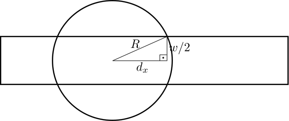

* TOC
{:toc}

Várias soluções compartilham uma mesma linha de raciocínio, um mesmo **paradigma** de projeto. Veremos agora os principais paradigmas de projeto de algoritmos e como podemos utilizá-los para resolver problemas eficientemente.

## Busca Completa 

Como o nome indica, a busca completa é responsável por exaurir todo (ou quase todo) o espaço de busca do problema em busca de uma solução. 

Uma solução baseada em Busca Completa nunca deveria estar errada, uma vez que todas as possibilidades de solução são checadas.

Para ilustrar o conceito, tome o seguinte problema ([UVA 725](https://uva.onlinejudge.org/index.php?option=onlinejudge&page=show_problem&problem=666)): dado dois inteiros $A=abcde$ e $B=ghijk$ de $5$ dígitos cada de modo que todos os dígitos de $0$ a $9$ sejam utilizados coletivamente pelos dois e um inteiro $N$, encontrar (quando possível) todos os valores de par $(A,B)$ tal que : 

$$
  \frac{abcde}{ghijk} = N
$$

Obviamente, o menor valor para $A$ e $B$ é $01234$, já o maior consiste em $98765$, assim, todos os possíveis valores de $A$ e $B$ estão no intervalo $[01234,98765]$, o que configura um espaço com tamanho $\approx10^5$. Como a divisão deve ser igual a $N$, podemos assumir que o espaço de busca é menor ainda, principalmente quando $N$ cresce. Dada essa discussão, o seguinte trecho de código é capaz de explorar todo o espaço de busca e resolver o problema: 





Considerando agora o seguinte problema ([UVA 441](https://uva.onlinejudge.org/index.php?option=onlinejudge&page=show_problem&problem=382)): Dado um conjunto de $k$ ($6\leq k < 13$) inteiros em ordem crescente, imprimir todos os subconjuntos de tamanho $6$ em ordem lexicográfica. O número máximo de subconjuntos pode ser expresso como: 

$$ \binom{12}{6} = 924$$

Ou seja, no máximo existe apenas $924$ possibilidades de acordo com as restrições do problema, o que é um espaço de busca bastante reduzido. Assim, para resolver o problema supracitado, basta utilizar uma estrutura com $6$ laços de repetição aninhados.





Uma estratégia parecida pode ser adotada no problema [(UVA 11565)](https://uva.onlinejudge.org/index.php?option=onlinejudge&page=show_problem&problem=2612), que consiste em, dados três inteiros $A$, $B$ e $C$ ($1\leq A,B,C \leq 10^5$), encontrar valores distintos $x$,$y$ e $z$ que satisfaçam simultâneamente as três equações abaixo:

$$\begin{eqnarray}
x + y + z & = &  A\\
x * y * z & = &  B\\
x^2 + y^2 + z^2 & = & C
\end{eqnarray}$$

No caso de haver múltiplas valorações que satisfaçam as equações simultêamente, a solução deverá escolher aquela com menor valor para $x$ possível.

De acordo com a última equação, é fácil ver que os valores de $x$, $y$ e $z$ obrigatoriamente devem estar no intervalo $[-100,100]$ de acordo com as restrições do tamanho de $A$, $B$ e $C$. Assim, ao todo temos $201 \cdot 201 \cdot 201 = 8.12 \cdot 10^6$ possibilidades, o que não é muito. Considerando esta observação, temos o seguinte código como solução.





Mais otimizações poderiam ser realizadas. Levando em consideração a equação $x * y * z = B$ e tomando o caso em que $x = y = z$, temos que $x *x * x < B$ e portanto, $x<\sqrt[3]{10^5}$. Logo, o intervalo considerado para $x$ poderia ser de $[-22,22]$, reduzindo ainda mais o espaço de busca.

Considere agora o problema [UVA 11742](https://uva.onlinejudge.org/index.php?option=com_onlinejudge&Itemid=8&page=show_problem&problem=2842), que consiste em: dado um número $N$ ($1\leq N \leq 8$) de pessoas que querem ver um filme e um número $M$ ($1\leq M \leq 20$) de restrições, calcular o total de possibilidades possíveis segundo as restrições. Uma restrição consiste em duas pessoas e o número máximo (ou mínimo) de assentos nos quais estas pessoas devem estar afastadas.

Gerar todas as permutações possíveis de pessoas leva tempo $O(N!)$ e checar se uma permutação está consistente com as restrições, leva tempo $O(M+N)$ com uma a implementação for cuidadosa, desta forma, o custo total do algoritmo seria $O((M+N)\cdot N!)$, o que é factível pelas dimensões do problema. Felizmente, para gerar todas as permutações, é possível utilizar a biblioteca `<algorithm>` juntamente com o método `next_permutation`, que dada uma permutação, gera a próxima.

O problema em questão, poderia ser resolvido segundo o esboço abaixo.





No problema [UVa 12455](https://uva.onlinejudge.org/index.php?option=com_onlinejudge&Itemid=8&page=show_problem&problem=3886), dado um conjunto de inteiros $S$, ($1\leq \lvert S\lvert \leq 20$) e um inteiro $X$, deseja-se saber se existe algum subconjunto de $S$ cuja soma é $X$. Tal problema é conhecido como *Subset Sum* e pode ser resolvido via **Programação Dinâmica**, entretanto, devido às restrições do tamanho de $S$, ele é passível de ser resolvido por busca completa, gerando no máximo $O(2^n)$ subconjuntos. Traduzindo para o tamanho da entrada, são feitas na ordem de $2^{20} \\approx 10^6$ operações.

Utilizando operações bit-a-bit, é possível gerar todos os subonjuntos de um conjunto $S$ de uma forma iterativa, basta lembrar que, utilizando $n$ bits, é possível representar $2^n$ valores. Desta forma, todos os inteiros no intervalo $[0,2^n]$ representariam cada um subconjunto de $n$ elementos de forma que, se o $i$-ésimo bit do inteiro está ligado, significa que o $i$-ésimo elemento do conjunto  original pertence ao subconjunto. Caso o $i$-ésimo bit estivesse desligado, o oposto valeria, isto é, que o $i$-ésimo elemento de $S$ não pertence ao subconjunto associado ao inteiro. Isso dá margem para a seguinte solução.





### Backtracking 

Um método bem conhecido que utiliza da busca completa é o **backtracking**. Durante a busca no backtraking, é possível realizar algumas "podas" e deixar de explorar algumas regiões do espaço de busca, desde que demonstradas que elas não contribuam para a solução final.

Vamos pegar como exemplo o problema clássico das **8 rainhas** ([UVA 750](https://uva.onlinejudge.org/index.php?option=com_onlinejudge&Itemid=8&page=show_problem&problem=691)). Neste problema o objetivo é posicionar $8$ rainhas em um tabuleiro de xadrez, que possui dimensões $8\times 8$ sem que uma rainha esteja em posição de atacar a outra. A figura abaixo ilustra um exemplo de solução deste problema.

O número possível de configurações das $8$-rainhas é de $\binom{64}{8} = 4426165368  \approx 4\cdot 10^{10}$, o que representa um imenso espaço de busca.

Uma solução do jogo não pode admitir duas rainhas na mesma coluna, pois se fosse o caso, elas estariam em posição de ataque uma com a outra. Com esta observação, o espaço de busca é reduzido para $8^8 = 16777216 \approx 10^ 8$.

Utilizando o mesmo argumento acima, mas para as diagonais e linhas, o espaço de busca é reduzido substancialmente, ou seja, a posição de uma rainha é válida somente se ela não encontra-se na mesma coluna, diagonal ou linha de outra rainha.

A solução pode ser colocada como o seguinte código.





### Dicas para Soluções Baseadas em Busca Completa

O principal problema de uma solução baseada em busca completa é justamente o tamanho do espaço de busca. No entanto, existem algumas dicas que podem ajudar no projeto de uma solução deste tipo.

1. (Geradores vs Filtros) Programas podem ser baseados em gerar todas as soluções e selecionar aquelas válidas, como no caso  do exemplo das 8-rainhas, ou gerar uma solução válida incrementalmente, partindo de subsoluções, ao mesmo tempo que poda soluções inválidas. A primeira situação é mais simples de construir, mas a segunda geralmente tem uma eficiência maior.
2. (Poda de soluções inválidas ou piores) Pode soluções inválidas o mais cedo possível, isso acarretará em um espaço de busca menor e consequentemente, menos processamento será utilizado. Outra estratégia é, se dada uma subsolução, o possível valor da solução formada a partir desta for pior que o valor de uma solução já encontrada, a poda pode ser efetuada sem problemas.
3. (Explore a Simetria) algumas soluções podem ser obtidas de outras soluções considerando uma rotação ou um espelhamento, dispensando efetuar o processamento para encontrá-las. Sempre que necessário, explore essa propriedade.
4. (Pré-processamento) Dependendo do problema, é vantajoso perder um tempo construindo alguma estrutura de dados que agilize algum tipo de consulta, isto é conhecido como **pré-processamento**.
5. (Otimize seu código) Procure otimizar sempre que possível, métodos de leitura, acesso a memória, uso da memória *cache*. Um bom entendimento da arquitetura de computador pode ajudar a agilizar uma solução baseada em busca completa. Exemplos:
- Acessar matrizes linha por linha é mais eficiente do que coluna por coluna;
- Utilizar vetores de bits é mais eficiente do que utilizar um vetor de booleanos ou de inteiros. Menos acessos à memória são necessários.
- Utilize estruturas fixas com tamanho suficiente para a maior entrada do problema. Isto pode ser preferível do que utilizar estruturas dinâmicas como `<vector>` se o objetivo é otimizar o máximo de tempo possível.
- Com base no exemplo anterior, declare o máximo dessas variáveis em escopo global (não use isso em qualquer coisa que não seja programação competitiva).
- Utilizar vetores para `char` normalmente é mais eficiente do que usar o tipo `string` do C++.
6. (Estruturas de Dados) Utilize melhores estruturas de dados e algoritmos. Às vezes a busca completa pode não ser a melhor solução.

## Divisão e Conquista

[Slides](assets/Busca Binária.pdf)

## Algoritmos Gulosos

Um algoritmo é dito **guloso** se ele faz uma escolha local ótima a cada passo esperando chegar na solução ótima global. Em alguns casos, os algoritmos gulosos funcionam bem: a solução é curta e eficiente. Em muitos outros casos, a solução gulosa não funciona.

Para um algoritmo guloso funcionar, ele deve:

1. Possui subestrutura ótima:
   - A solução ótima do problema pode ser decomposta em soluções ótimas de subproblemas.
2. Ele tem que ter a propriedade gulosa:
   - Se ao realizar uma escolha gulosa e proceder a resolver o problema que restou, chegamos na solução ótima, então existe a propriedade gulosa.

Vamos tomar alguns exemplos para ilustrar esse problema.

### Problema do Troco

Seja uma quantia $V$ e uma lista de $n$ moedas, cada moeda possui um valor $value[i]$ em que $i\in [0,n-1]$.

A estratégia gulosa é: utilize a moeda com maior valor possível que é menor do que a quantia $V$ e continue com o subproblema $V-x$ em que $x$ é o valor da moeda utilizada.

Por exemplo, se $value={25,10,5,1}$ e $V=42$, então a estratégia faria:

- $V = 42$: utilize uma moeda de $25$, resta $17$.
- $V=17$: utilize uma moeda de $10$, resta $7$.
- $V=7$: utilize uma moeda de $5$, resta $2$.
- $V=2$: utilize uma moeda de $1$, resta $1$.
- $V=1$: utilize uma moeda de $1$, fim.

Essa estratégia, para este sistema de moedas, leva a uma solução ótima, com um total de $5$ moedas.

Analisando melhor o problema, temos que:

1. Ele tem subestrutura ótima:
  - Para resolver o problema com $V=42$ utilizamos a solução de quando $V=17$, uma vez que as moedas $10+5+1+1$ foram utilizadas.
2. Ele tem a propriedade gulosa: para cada quantidade $V$, podemos escolher a maior moeda que é menor ou igual a $V$ que nos levará a solução ótima global.

A estratégia gulosa nos fornece um sistema muito simples, mas ela só funciona no caso de um sistema canônico de moedas, que é o caso da maioria dos sistemas financeiros. Caso as moedas disponíveis fossem $value = {4,3,1}$ e o valor a ser pago fosse $V=6$, a estratégia gulosa nos daria $3$ moedas enquanto a solução ótima consiste de duas moedas de $3$.

Para resolver o problema geral do troco, em que o sistema de moedas não necessáriamente é canônico, pode-se utilizar a abordagem de **Programação Dinâmica**.

### UVa 410 -  Station Balance

Tome o problema [UVa 410](https://uva.onlinejudge.org/index.php?option=com_onlinejudge&Itemid=8&page=show_problem&problem=351). Existem $1\leq C \leq 5$ câmaras que podem armazenar $0$,$1$ ou $2$ espécimes, $1 \leq S \leq 2C$ espécimes e uma lista $M$ da massa de cada uma das $S$ espécimes. 
O problema consiste em determinar qual câmara deve armazenar cada espécime para minimizar o desequilíbrio. 

Este é um problema conhecido como **balanceamento de carga**, muito utilizado no contexto de Máquinas Virtuais e Computação em Nuvem. Basicamente, seja: $A$ a média da massa considerando as $C$ câmaras:

$$ A = \sum_{j=1}^{S} \frac{M_j}{C} $$

O objetivo é minimizar 

$$\sum_{i=1}^{C} |X_i -A|$$

Em que $X_i$ é a massa total presente na $i$-ésima câmara.

Isto é, minimiza a soma das diferenças da massa total em cada câmara em relação a média $A$.

A estratégia gulosa que resolve esse problema é a seguinte:

1. Se $S<2C$, adicione $2C-S$ espécimes com massa $0$.
2. Ordene as espécimes pela massa.
3. Para cada câmara $i$: pareie as espécimes de massa $M_i$ e $M_{2C-i+1}$ na câmara.

Uma dica que funciona neste caso, e em muitos outros, é que em alguns casos, ordenar a entrada pode ajudar.

### UVa 10382

Tome agora o problema [UVa 10382](https://uva.onlinejudge.org/index.php?option=onlinejudge&Itemid=8&page=show_problem&problem=1323). Suponha uma faixa retangular de grama com dimensões de comprimento e largura $l\times w$ e uma quantidade de $n$ irrigadores. Cada irrigador possui uma abrangência circular com raio $R$ e está posicionado no centro da faixa de grama e com o centro posicionado a uma distância horizontal do início da faixa, conforme figura abaixo:

Como o número de irrigadores é no máximo $10000$, uma solução via busca completa é inviável, levaria $2^{10000}$ possibilidades, uma vez que esse número representa a quantidade de subconjuntos de irrigadores possíveis.

Fazendo uma análise trigonométrica, é possível ver que, cada irrigador cobre no máximo uma distância horizontal $d_x$ do seu centro, conforme figura abaixo:

Como temos um triângulo retângulo, o valor de $d_x = \sqrt{(R^2 - \frac{W}{2}^2 )}$. Logo, cada círculo com centro em $(x,y)$, cobre todo o intervalo da faixa $[x-dx,x+dx]$.

Reduzimos este problema para o problema de interseção de intervalos que possui uma solução gulosa!

1. Ordene todos os círculos em ordem crescente pela extremidade da esquerda $x-dx$. Em caso de empate, dê preferência para o maior valor de $x+dx$ (extremidade da direita). 
2. Insira o primeiro círculo na solução. Caso ainda exista uma porção não coberta à esquerda do primeiro círculo, a resposta já é não.
3. Enquanto houver círculos a serem analisados ou enquanto a faixa não tiver sido coberta.
   1. Escolha o círculo com maior $x+dx$ e que tenha interseção com o último cículo inserido na solução e coloque o círculo escolhido na solução.. 
4. Cheque a solução e verifique se ela tem "buracos". Em caso negativo, você conseguiu encontrar a menor quantidade de irrigadores que resolve o problema, que corresponde ao número de círculos na solução.

### UVa 11292 

No problema [UVa 11292](https://uva.onlinejudge.org/index.php?option=onlinejudge&Itemid=8&page=show_problem&problem=2267) são dados $n$ cabeças de dragão e $m$ cavaleiros. Cada cabeça de dragão tem um diâmetro $D$ e cada cavaleiro tem uma altura $H$. O cavaleiro pode cortar a cabeça do dragão somente se a sua altura $H\geq D$.

Dado uma lista de diâmetros de cabeça e outra de alturas de cavaleiros, o problema consiste em determinar 
1. Se é possível cortar todas as cabeças de dragão
2. Em caso afirmativo, qual o total mínimo da soma das alturas dos cavaleiros que compõem uma solução.

Neste problema, mas uma vez ordenar faz sentido. Ordena-se a lista de alturas e diâmetros de cabeça e utiliza-se a seguinte inspeção linear:





### Dicas para Algoritmos Gulosos

- Provar a correção da solução gulosa leva tempo.
- Se o tamanho da entrada for suficientemente pequeno para acomodar uma solução de Programação Dinâmica ou Busca Completa, utilize ela em vez da solução gulosa, uma vez que esta não é certa de funcionar em qualquer problema.
- Ordenar a entrada pode ajudar a pensar na escolha gulosa.
- Algoritmos gulosos geralmente são eficientes em contrapartida aos elaborados usando outras abordagens.

## Programação Dinâmica

Para ilustrar o conceito de Programação Dinâmica, utilizaremos um exemplo do problema [UVa 11450](https://uva.onlinejudge.org/index.php?option=onlinejudge&page=show_problem&problem=2445).

Este problema é sobre compras de paças de vestuário para ir a um casamento. Existe $C$ ($1\leq C \leq 20$) tipos de peças de roupa diferentes e $M$ ($1\leq M \leq 200$) o montante disponível. Para cada um dos $C$ tipos de peça, existe um número $K$ ($1\leq K \leq 20$) de peças daquele tipo, cada um com uma descrição de preço. O objetivo é gastar o máximo possível, comprando exatamente uma peça de cada tipo, sem exceder uma quantia $M$ ($1\leq M \leq 200$)

A solução deverá indicar qual o valor máximo gasto, ou a impossibilidade de gastar um valor menor ou igual a $M$.

Para exemplificar o problema, tome o seguinte cenário, o montante disponível é $M=20$, e existem três tipos de peça:

- Três camisas com custos $(6,4,8)$.
- Duas gravatas com custos $(5,10)$.
- Três sapatos com custos $(1,5,3,5)$.

Uma solução para este problema é pegar uma camisa de custo $8$, uma gravata e custo $10$ e um sapato de custo $1$, totalizando $19$. Outra solução seria obter uma camisa de custo $6$, uma gravata de custo $10$ e um sapato de custo $3$.  Não existe solução que gaste $20$.

Supondo o mesmo cenário, mas com $M=9$, mesmo se pegássemos os items mais baratos de cada tipo, não conseguiríamos ficar abaixo do montante disponível. Neste caso, o problema não possui uma solução.

**Abordagem 1: Algoritmo Guloso (WA)**

Podemos pensar em um algoritmo guloso que sempre pega o item mais caro de cada tipo que não excede o montante disponível. No entanto, a solução nem sempre é correta.

Tome o exemplo anterior, mas com $M=12$. Com uma abordagem gulosa, inicialmente, pegaríamos uma camisa de custo $8$, reduzindo o montante para $M=4$ e com esta quantia, não conseguimos comprar nenhuma gravata. O algoritmo guloso então reportaria que não existe solução, quanto na verdade, uma solução ótima nesse cenário envolve uma camisa com custo $4$, uma gravata de custo $5$ e um sapato de custo $3$ ($4+5+3 = 12$). 

**Abordagem 2: Divisão e Conquista (WA)**

Este problema não pode ser resolvido via o paradigma de divisão e conquista pelo motivo de que os subproblemas não são independentes um do outro.

**Abordagem 3: Busca Completa (TLE)**

A abordagem de busca completa pode resolver esse problema, mas devido ao tamanho da entrada, ela tomará muito tempo.
A estratégia é, escolha o $i$-ésimo modelo do $j$-ésimo tipo de peça, subtraia o montante atual pelo preço do $i$-ésimo modelo e proceda recursivamente para o $j+1$-ésimo tipo de peça.  De todas as combinações válidas, escolhemos aquela que maximiza a quantia gasta e que não excede o montante inicial.

O código abaixo ilustra um esboço da solução.





Como uma entrada pode ter no máximo $C = 20$ tipos de peça e cada tipo de peça pode possuir $K=20$ modelos, temos que a busca completa leva $20^{20}$, operações, o que é demais.

**Abordagem 4: Programação Dinâmica Top-Down (AC)**

Podemos perceber que o problema tem duas propriedades interessantes.

1. Subestrutura ótima: a solução para o subproblema é parte da solução do problema maior. Isto é, se o $i$-ésimo elemento do $k$-ésimo tipo  tipo de peça está na solução, a solução do subproblema sem a peça escolhida tem que ser ótima. 
2. O problema tem sobreposição de subproblemas. O espaço de busca $20^20$ possui muitos subproblemas que se sobrepoem.

O item 2. é chave para as soluções baseadas em DP. Como existe sobreposição de subproblemas, podemos trocar espaço por tempo. Sempre que um subproblema é resolvido, armazenamos a sua solução e, no caso de sua recorrência, o valor já computado é utilizado.

Podemos utilizar a solução baseada em busca completa discutida anteriormente e utilizar uma técnica de *memoization* para guardar as soluções dos subproblemas. Sempre que nos deparamos com subproblemas, primeiramente verificamos se eles já foram resolvidos: em caso afirmativo, utilizamos a solução já computada, em caso negativo, computamos a solução e armazenamos a resposta em uma ED. 

Isso dá origem ao seguinte algoritmo:





Como estamos referenciado uma única célula, podemos deixar o código mais enxuto ao utilizar uma referência para a célula.





**Abordagem 5: Programação Dinâmica Bottom-up (AC)**

É possível implementar uma solução de Programação Dinâmica interativa, sem o uso de recursão. Chamamos essa abordagem de *bottom-up*. A estratégia dela é construir a solução de problemas do menor para o maior tamanho.

Vamos modelar o problema da seguinte forma: a solução de $S(i,m)$ nos diz se é possível ter o montante $m$ restante após comprar uma peça de cada um dos $i+1$ primeiros tipos. Claramente, $S(0,m)$ é verdadeiro sempre que $M-x\geq 0$, em que $x$ é o preço dos items de tipo $0$.

Suponha agora que tenhamos $S(i,m)$ computado para todo $0\leq i < C$ e $0\leq m \leq M$.
Caso seja possível chegar no montante final $m$ após utilizar os $i$ primeiros tipos, tentamos incluir as peças do $i+1$ primeiro tipo na solução. Para cada valor das peças  tipo $i+1$, verificamos se o montante $m$ de $S(i,m)$ que sobrou é suficiente para incluir a peça, se for possível, então $S(i+1,m-x)$ tem que ser verdadeiro, em que $x$ é o valor da peça.

Resumindo o discutido em uma única relação de recorrência, temos:

Isso gera a seguinte solução.





É fácil ver que, para a computação da $i$-ésima linha desta tabela, só precisamos olhar para a linha anterior. Então poderíamos economizar espaço e utilizar uma tabela com duas linhas, uma para a solução $i-1$-ésimo item e uma para a solução considerando o $i$-ésimo item.

**Comparação entre as abordagens Top-Down e Bottom-Up**

Ambas as abordagens são interessantes para resolução de problemas envolvendo programação dinâmica, cada uma com suas vantagens e desvantagents.

Top-Down:
- Vantagens
  - Pode ser derivada de uma solução baseada em busca completa.
  - Computa os subproblemas apenas quando necessário.
- Desvantagens
  - Mais lenta se subproblemas são revisitados frequentemente, por conta da chamada recursiva.
  - Se existem $M$ possíveis estados, é necessário de uma tabela com dimensão $O(M)$. 

Bottom-up:
- Vantagens
  - Mais rápida se subproblemas são revisitados frequentemente.
  - Mais econômica em espaço se utilizar o truque de excluir uma dimensão.
- Desvantagens
  - Mais difícil para programadores que possuem mais afinidade com recursão.
  - Todos os subproblemas devem ser resolvidos para construir a solução de problemas maiores.

## Problemas Clássicos

A seguir serão ilustrados vários problemas clássicos da Computação que envolvem soluções baseadas em _Programação Dinâmica_.

### 2D Range Sum

Dada uma matriz $M_{n\times m}$ contendo números inteiros (positivos e negativos), o objetivo é achar o retângulo que maximize a soma dos inteiros contidos nele e dizer qual a soma.

**Solução força-bruta**

A solução força-bruta simplesmente computa, de maneira ingênua, a soma de todos os possíveis retângulos. Um retângulo é definido por um par de coordenadas $(x_1,y_1)$ e $(x_2,y_2)$, em que o primeiro representa o canto superior esquerdo e o último o canto inferior direito, conforme figura abaixo.

Essa solução força-bruta pode ser representada de acordo com o seguinte esboço.





O algoritmo apresentado é ineficiente, uma vez que existem $\Theta(n^2m^2)$ possíveis retângulos, o que nos levaria a um algoritmo com complexidade total de $\Theta(n^3m^3)$.

**Solução Programação Dinâmica**

Podemos resolver esse problema em tempo $\Theta(n^2m^2)$ desde que seja possível realizar a soma de um retângulo $(x_1,y_1)$ $(x_2,y_2)$ em tempo constante. Para isso utilizaremos uma técnicas de programação dinâmica.

Suponha que uma matriz $S_{n\times m}$ foi computada e que $S[i,j]$ contém a soma do retângulo $(0,0)$ $(i,j)$. Como computar a soma do retângulo $(x_1,y_1)$ $(x_2,y_2)$ a partir disso?

Observando a figura abaixo, temos que a soma contida no retângulo $(x_1,y_1)(x_2,y_2)$ é simplesmente a soma do retângulo $(0,0)(x_2,y_2)$ (cores rosa, roxo, dourado e marrom) menos a soma do retângulo $(0,0)(x_2,y_1-1)$ (cores marrom e dourado), menos a soma do retângulo $(0,0)(x_1-1,y_2)$ (cores marrom e roxo), mais a soma do retângulo $(0,0)(x_1-1,y_1-1)$ (cor marrom). Temos que adicionar a soma do retângulo marrom, pois ele foi contabilizado duas vezes nos retângulos marrom/dourado e marrom/roxo.

Traduzindo isso para termos de $S$, temos que a soma do retângulo $(x_1,y_1)(x_2,y_2)$ é simplesmente $S[y_2][x_2] -S[y_1-1][x_2] - S[y2][x_1-1] +  S[y_1-1][x_1-1]$. Em código isso é ilustrado abaixo.





Dado que $S$ está computado, a soma de qualquer retângulo pode ser obtida com $3$ operações aritméticas, portanto leva tempo $\Theta(1)$.

A pergunta que fica é: como computar $S$ em tempo eficiente?
Utilizamos uma técnica similar. O retângulo $(0,0)(i,j)$ é simplesmente a soma do retângulo $(0,0)(i-1,j)$ mais a soma do retângulo $(0,0)(i,j-1)$ menos a soma do retângulo (0,0)(i-1,j-1) mais o valor contido na célula $M[i][j]$. Isto é exemplificado pela figura abaixo, o que fazemos é somar o retângulos vermelho e dourado, o retângulos dourado e amarelo, o retângulo verde e retiramos o retângulo dourado, pois foi contabilizado duas vezes.

Essa discussão é traduzida na seguinte relação de recorrência:

$$

S(i,j) = \left\{
  \begin{array}{l}
    M[0][0],\quad i=0 \land j=0\\
    S(i-1,0) + M[i][0], \quad i>0 \land j = 0\\
    S(0,j-1) + M[0][j],\quad i=0 \land j>0\\
    S(i-1,j) + S(i,j-1) - S(i-1,j-1) + M[i][j],\quad i>0 \land j>0\\
  \end{array}
\right.

$$

O que gera o código abaixo.





A partir do pré-processamento de $S$, que leva tempo $\Theta(nm)$ é possível calcular a soma de qualquer retângulo em tempo constante. Isso possibilitar a maior soma dentre todos os retângulos em tempo $\Theta(n^2m^2)$.

### Longest Increasing Sequence (LIS)

Seja $V = (v_0,v_1,v_2,\ldots,v_{n-1})$ uma sequência de $n$ valores.
Uma sequência $S$ é uma subsequência de $V$ se $S = (v_{i_0},v_{i_1},\ldots,v_{i_{k-1}})$ com $0\leq i_{0} < i_{1} < \ldots < i_{k-1} < n$. Em outras palavras, $S$ é uma subsequência de $V$ se pode ser formada por elementos de $V$, desde que lidos da esquerda para direita, e não necessariamente consecutivos.  Por exemplo, se $V=(-7,10,9,2,3,8,8,1)$, uma subsequência de $V$ pode ser $S=(-7,9,2,3,1)$.

No problema da maior subsequência crescente (Longest Increasing Sequence ou LIS), o interesse é obter uma subsequência de $V$ que seja:
  
1. Maior possível;
2. Seus elementos sejam crescentes.

No caso do exemplo anterior, a maior subsequência crescente de $V=(-7,10,9,2,3,8,8,1)$ é $S=(-7,2,3,8)$, que possui comprimento $4$.

Obviamente a abordagem gulosa, de pegar o próximo elemento que é maior que o último escolhido não vai funcionar neste caso, pois se inserimos o $-7$ na solução, a abordagem gulosa incluiria o $10$ como próximo elemento, o que impossibilitaria a inserção de qualquer outro número.

Suponha que tenhamos calculado em $L(k)$ $(0\leq k < i)$ o tamanho da maior subsequência crescente de $V = (v_0,\ldots,v_k)$ e que termina obrigatoriamente com o item $v_k$, como computar $L(i)$?

Se $L(i)$ tem que terminar obrigatoriamente com $v_i$ temos que chegar quais das subsequências anteriores possibilitam a inserção de $v_i$ como último elemento (a subsequência deve ser crescente) e maximizam o tamanho.

Desta forma, podemos definir $L(i)$ como:

$$
L(i) = \left\{
  \begin{array}{l}
  1,\quad i = 0\\
  x+1,\quad \text{ em que } x = \max_{0\leq k <i}\{|L(k)|\;|\; v_k < v_i\},\quad i>0
  \end{array}
\right.
$$

Esta relação de recorrência pode ser traduzida no seguinte código.





### Boolean Knapsack (Mochila Booleana)

Outro problema clássico é o _Problema da Mochila 0-1_. Neste problema, existe uma coleção de $n$ itens, cada um contendo um peso $w[i]$ e um valor $v[i]$. O objetivo é escolher itens de modo a maximizar o valor sem exceder uma capacidade de peso $W$. No caso deste problema, existe uma única instância de cada item.

Por exemplo se $v=(100,70,50,10)$, $w = (10,4,6,12)$ e $W = 12$, uma solução que maximiza o valor dos itens, sem exceder a capacidade $W$, é pegar os itens de peso $4$ e $6$ obtendo o valor $120$.

A solução de programação dinâmica consiste em computar a seguinte relação de recorrência:

$$
T(i,j) = \left\{
  \begin{array}{l}
    0,\quad  j<w[0]\\
    v[0],\quad i=0\land j\geq w[0]\\
    \max(a,b),\quad i>0 \quad \text{ em que} \\
    \qquad a = T(i-1,j)\\
    \qquad b = T(i-1,j-w[i]) + v[i],\quad \text{ se $j\geq w[i]$}, \text{ ou $b=0$, caso contrário}.\\
  \end{array}
\right.
$$

Esta equação nos diz qual o maior valor que é possível obter considerando apenas os itens de valor $v_0,\ldots,v_i$ com pesos $w_{0},\ldots,w_{i}$ e que não excedam a capacidade $j$. Podemos ver que o caso base desta equação de recorrência é $0$, quando $i=0\lor j<w[0]$, e $v[0]$ quando $j\geq w[0]$, isto é, considerando apenas o primeiro item, conseguimos obter o valor do primeiro item apenas quando a capacidade é maior ou igual ao peso dele. O caso geral nos diz que a solução de $T(i,j)$ é obtida da solução sem o $i$-ésimo item, $T(i-1,j)$,  ou considerando o $i$-ésimo item. Se o $i$-ésimo item deve ser considerado, a solução ótima tem que partir de $T(i-1,j-w[i])$, a solução considerando os $i-1$ primeiros itens com capacidade máxima de $j-w[i]$, visto que queremos incluir um item de peso $w[i]$.  Note que no segundo caso,  $j$ deve ser maior ou igual ao peso do $i$-ésimo item, senão $T(i,j)$ deve considerar apenas $T(i-1,j)$.

Esta discussão nos leva para o seguinte código.





Como cada linha da matriz de programação dinâmica só depende da anterior, podemos realizar a computação utilizando apenas duas linhas, conforme código abaixo,





### Coin Change (Troco) 

O problema do troco se resume a, dado um conjunto de valores de  moeda  $v= \{ v_0,v_1,\ldots,v_{n-1}\} $,  e uma quantia $W$, determinar o número mínimo de moedas que pague $W$. Neste problema, assume-se que existe uma quantidade infinita de moedas de cada valor.

A solução de programação dinâmica consiste em computar a seguinte relação de recorrência:

$$
T(i,j) = \left\{
  \begin{array}{l}
    0,\quad  j=0\\
    j/v[0],\quad i=0\land j>0 \land j \mod v[0] = 0\\
    \infty,\quad i=0 \land j>0 \land j \mod v[0] \neq 0\\
    \min(a,b),\quad i>0 \quad \text{ em que} \\
    \qquad a = T(i-1,j)\\
    \qquad b = T(i,j-w[i]) + 1,\quad \text{ se $j\geq v[i]$}, \text{ ou $b=\infty$, caso contrário}.\\
  \end{array}
\right.
$$

A interpretação desta equação é $T(i,j)$ é o número mínimo de moedas para pagar o valor $j$ considerando apenas as moedas $v_0,\ldots,v_i$. O caso base, $j=0$ requer $0$ moedas, uma vez que o valor a ser pago é nulo.  Considerando apenas a primeira moeda, quando $i=0$, só conseguimos pagar quando o valor $j$ é divisível por $v_0$;  neste caso, utiliza-se $\frac{j}{v_0}$ moedas;   caso contrário não há solução, simbolizado com o valor $\infty$. Para o caso geral, a solução pode: não utilizar a moeda $v_i$, neste caso a solução encontra-se em $T(i-1,j)$; utilizar a moeda $v_i$, neste caso a solução encontra-se em $T(i,j-v[i])$ e devemos adicionar mais uma moeda a solução, desde que $j\geq v[i]$. O segundo caso, diferentemente do Problema da Mochila Booleana, recupera a solução de  $T(i,j-v[i])$ e não de $T(i-1,j-v[i])$, uma vez que adimitimos repetição da $i$-ésima moeda.

Isto leva ao seguinte código.





O mesmo truque de economia de memória do problema da mochila 0-1 pode ser utilizada neste caso, uma vez que cada linha da matriz só depende da linha imediatamente anterior.

## Leituras Recomendadas

- [Top 50 Dynamic Programming Practice Problems](https://blog.usejournal.com/top-50-dynamic-programming-practice-problems-4208fed71aa3)
- [Dynamic Programming: Geeks for Geeks](https://www.geeksforgeeks.org/dynamic-programming/)
- [7 Steps to solve a Dynamic Programming problem](https://medium.freecodecamp.org/follow-these-steps-to-solve-any-dynamic-programming-interview-problem-cc98e508cd0e)